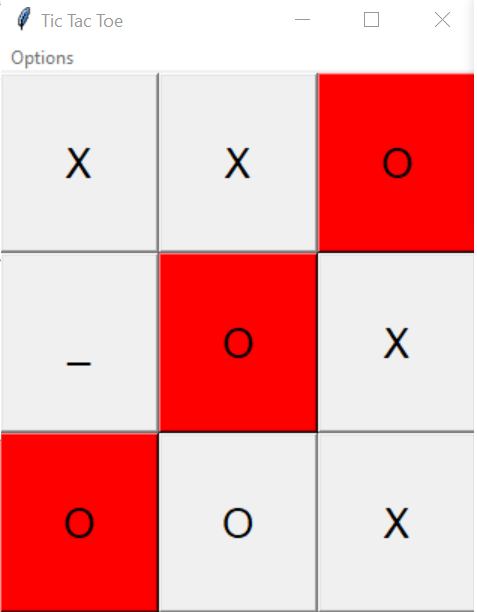
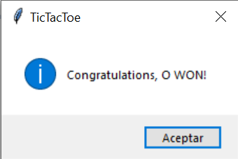

# TicTacToeNp
Tic Tac Toe GUI game done with tkinter and Numpy arrays

Player X starts the game
Click on each grid to place symbol
The result of the game is displayed on a messagebox at the end of the game
Click  on options then reset to start again. 

